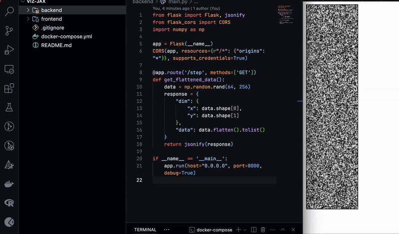

# Visualization Demo for Jax

**Currently it doesn't visualize jax data, its a minimal scaffolding for the visualization.**

1. It has a step function which'll be our data transfer point.
2. Visualization is done by canvas element.

